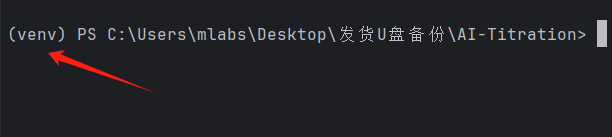
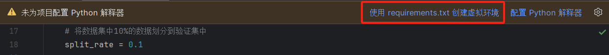

# 基于计算机视觉的AI滴定控制装置
## Mlabs AI Titration 1.0
## **[慕乐网络科技(大连)有限公司, MoolsNet](https://www.mools.net/)**

### 本软件推荐使用的软件及其版本为：

[Python3.10.11(64-bit)](https://www.python.org/ftp/python/3.10.11/python-3.10.11-amd64.exe)   
[Python3.10.11(32-bit)](https://www.python.org/ftp/python/3.10.11/python-3.10.11.exe)  
[Python 安装教程（新手）-CSDN博客](https://blog.csdn.net/qq_45502336/article/details/109531599)

[PyCharm](https://www.jetbrains.com/pycharm/download/?section=windows#section=windows)  
[PyCharm 安装教程-CSDN博客](https://blog.csdn.net/qq_44809707/article/details/122501118)

[Anaconda](exe/Anaconda3-2024.02-1-Windows-x86_64.exe)  
[最新 Anaconda3 的安装配置及使用教程-CSDN博客](https://blog.csdn.net/qq_43674360/article/details/123396415)  
[在 PyCharm 中配置使用 Anaconda 环境-CSDN博客](https://blog.csdn.net/TuckX/article/details/115681862)

这个软件包提供的是示例程序，理论上大家直接执行也可以完成整个滴定控制过程，但是我们还是希望大家可以发挥自己的创造力和奇思妙想，选用不同的控制方式、神经网络等

### 基于计算机视觉的AI滴定控制装置(AI_Titration)
软件包中的示例程序分别放置在3个文件夹中，此外附带了3个说明文件和1份附录文件夹，之所以这样做是比较符合一般常见的Python软件包的模式。

### Auto_Ctrl 
**Auto_Ctrl** 文件夹里面包含的是 **滴定控制程序** 和依赖项。本软件包中使用的是COM串口接电机控制板，电机控制滴定管开度的“致敬经典”方案。详情参见此文件夹中的`README.md`文件。

### Picture_Train
**Picture_Train** 文件夹里面包含的是 **权重训练程序** 、训练集、测试集以及依赖项。本软件包中使用的是Resnet34网络的训练程序。详情参见此文件夹中的`README.md`文件。

### LICENSE
**LICENSE** 此文件包含了项目的许可协议。这告诉用户和其他开发者他们如何使用、修改和分发代码。Python包通常使用开源许可协议，如MIT、BSD、Apache 2.0或GPL等。在 LICENSE 文件中，包含完整的许可协议文本，确保用户明确了解他们使用代码的权利和义务。

### README
**README** 此文件是项目的文档说明，它向用户提供了关于项目的详细信息。README 文件通常以Markdown格式编写（文件扩展名为 .md），这样它可以在GitHub等平台上以易于阅读的格式呈现。在PyPI上发布包时，README 文件的内容也可以作为项目的长描述显示。

### pths
**pths** 文件夹包含了现有的神经网络模型训练后得到的权重文件，后续新增的权重文件也会逐步更新，文件名将尽量以实验内容+Net命名

### requirements.txt
**requirements.txt** 文件在Python项目中扮演着非常重要的角色。它主要用于列出项目运行所需的所有外部Python包及其版本号。这个文件的主要目的是确保项目的依赖环境可以在不同的环境中被一致地重现，无论是开发环境、测试环境还是生产环境。

当你使用pip（Python的包管理工具）时，可以通过requirements.txt文件来安装项目所需的所有依赖包。这通过运行以下命令实现： 

1.新建一个虚拟环境  
在你的项目目录中，打开终端（在pycharm中可以在界面下部或左下部找到对应的终端功能）或命令提示符，然后运行以下命令来创建一个新的虚拟环境。这里，我们将虚拟环境命名为venv（或你可以使用任何你喜欢的名字）：
  
`python -m venv venv`  
这个命令会在你的项目目录中创建一个名为venv的文件夹，其中包含了虚拟环境的所有内容。  
2.激活虚拟环境  
创建虚拟环境后，你需要激活它。激活虚拟环境的方法取决于你的操作系统：  
Windows:  
`venv\Scripts\activate`  
macOS/Linux:  
`source venv/bin/activate`  
激活后，你的命令行提示符会发生变化，显示当前虚拟环境的名称（例如(venv)），表明你现在正在该虚拟环境中工作。

3.使用requirements.txt安装依赖  
确保你的项目目录中有一个requirements.txt文件，该文件列出了项目所需的所有Python包及其版本。然后，在激活的虚拟环境中，运行以下命令来安装这些依赖：  
`pip install -r requirements.txt`  
这个命令会读取requirements.txt文件中列出的所有包和版本号，并使用pip来安装它们。  
注意：请切换到本项目所使用的虚拟环境下使用此命令  
4.PyCharm的快捷方法  
当您使用PyCharm以项目打开本文件夹时，可能会弹出提示如下  
  
此时点击**使用requirements.txt 创建虚拟环境**即可新建虚拟环境

最后介绍一下软件包里附带的两个驱动

### ch340驱动官网下载
**ch340驱动官网下载** 文件夹里放的exe文件是USB转TTL串口工具的驱动，安装完成后重启电脑，即可在设备管理器里面查看该通讯模块的串口号

### sscom32
**sscom32** 文件夹里面是串口调试工具

视频教程可以参考assets文件夹内的两个视频

串口指令如下

